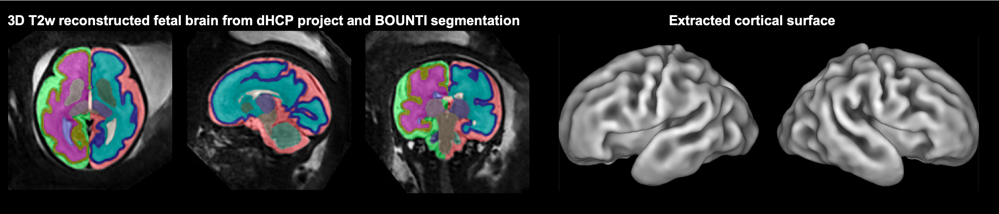

Scripts for automated brain surface processing for fetal MRI (work in progress)
====================

This repository contains scripts for automated extraction of brain sufaces for fetal brain MRI in [SVRTK surface dockers](https://hub.docker.com/r/fetalsvrtk/surface/) based on DrawEM pipeline](https://github.com/MIRTK/DrawEM) (Makropoulos, Robinson et al., 2018) using deep learning [BOUNTI](https://elifesciences.org/reviewed-preprints/88818) fetal brain segmentation outputs (Uus, Kyriakopoulou et al., 2023). 

I.e., the surface generation script does not require Draw-EM segmentation outputs and uses BOUNTI deep learning labels ([BOUNTI docker](https://hub.docker.com/r/fetalsvrtk/segmentation)) as an input instead :
- 3D T2w SVR reconstructed image in the [atlas](https://gin.g-node.org/kcl_cdb/fetal_brain_mri_atlas) space
- global BET brain label (output of BOUNTI)
- brain tissue segmentation labels (output of BOUNTI)
- corpus callossum label (output of BOUNTI)
- internal brain ROI label (output of BOUNTI)

_Note: The scripts were installed in the [**fetalsvrtk/surface:1.20**](https://hub.docker.com/r/fetalsvrtk/surface) docker container together with optimised parameter files and MIRTK software. I.e., they cannot be used as standalone applications and need to be executed from within the dockers._  

The surface generation scripts were originally created and optimised by [Logan Williams](https://github.com/lzjwilliams) and [Alena Uus](https://github.com/alenauus) under supervision of [Emma Robinson](https://github.com/ecr05) based on Draw-EM. Additional optimisation and testing was performed by Aakash Saboo and Vanessa Kyriakopoulou and many other contributors.     

Development of SVRTK surface module was supported by projects led by Dr Emma Robinson, Dr Maria Deprez, Prof Mary Rutherford, Dr Lisa Story, Prof David Edwards and Prof Jo Hajnal.

License
-------

The code in surface SVRTK repository is distributed under the terms of the
[Apache License Version 2](http://www.apache.org/licenses/LICENSE-2.0). The license enables usage of SVRTK in both commercial and non-commercial applications, without restrictions on the licensing applied to the combined work.

Citation and acknowledgements
-----------------------------

In case you found SVRTK useful please give appropriate credit to the software:  

> SVRTK surface dockers: [https://hub.docker.com/r/fetalsvrtk/surface](https://hub.docker.com/r/fetalsvrtk/surface/)

> SVRTK segmentation dockers: [https://hub.docker.com/r/fetalsvrtk/segmentation](https://hub.docker.com/r/fetalsvrtk/segmentation/)

> Makropoulos A, Robinson EC, Schuh A, Wright R, Fitzgibbon S, Bozek J, Counsell SJ, Steinweg J, Vecchiato K, Passerat-Palmbach J, Lenz G, Mortari F, Tenev T, Duff EP, Bastiani M, Cordero-Grande L, Hughes E, Tusor N, Tournier JD, Hutter J, Price AN, Teixeira RPAG, Murgasova M, Victor S, Kelly C, Rutherford MA, Smith SM, Edwards AD, Hajnal JV, Jenkinson M, Rueckert D. The developing human connectome project: A minimal processing pipeline for neonatal cortical surface reconstruction. Neuroimage. 2018 Jun;173:88-112. doi: [https://doi.org/10.1016/j.neuroimage.2018.01.054](https://doi.org/10.1016/j.neuroimage.2018.01.054).

> Uus, A. U., Kyriakopoulou, V., Makropoulos, A., Fukami-Gartner, A., Cromb, D., Davidson, A., Cordero-Grande, L., Price, A. N., Grigorescu, I., Williams, L. Z. J., Robinson, E. C., Lloyd, D., Pushparajah, K., Story, L., Hutter, J., Counsell, S. J., Edwards, A. D., Rutherford, M. A., Hajnal, J. V., Deprez, M. (2023) BOUNTI: Brain vOlumetry and aUtomated parcellatioN for 3D feTal MRI. eLife12:RP88818; doi: [https://doi.org/10.1101/2023.04.18.537347](https://doi.org/10.7554/eLife.88818.1)

Disclaimer
-------

This software has been developed for research purposes only, and hence should not be used as a diagnostic tool. In no event shall the authors or distributors be liable to any direct, indirect, special, incidental, or consequential damages arising of the use of this software, its documentation, or any derivatives thereof, even if the authors have been advised of the possibility of such damage.

